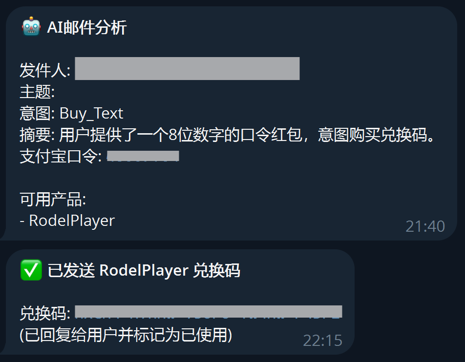
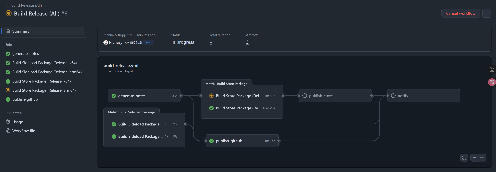

# 记我的自动化构建流程

## 怎么开始的？

一开始，我并没有想着创建什么 CI/CD，只是为了解决一个棘手的问题——收钱。

我发布了小幻影视，对特定功能收费，按照官方文档指引，我使用了 Microsoft Store 支付SDK，这也让我被狠狠地坑了一把——大量的中国用户无法完成支付。

他们或是因为稀奇古怪的网络防火墙拦截，或是根本不屑于注册微软账户，或是用了“精简”系统，或是改动了自己的账户区域……

种种原因，不一而足，我被迫开启另外一种购买渠道——激活码。

用户通过向我的邮箱发送支付宝口令红包，我在收红包之后发送激活码。

听上去很简单，但我也不是 24 小时守在邮箱前，所用的手机经常不通知，导致时不时就会错过激活码购买邮件。（虽然红包有24小时的有效期，但我经常写代码写忘记……）

总之，在经过漏收红包，发错激活码等事件之后，我意识到人力有时穷，是时候让机器来帮我干这个事儿了。

恰好之前给群里做过一个杀广告的机器人，我一寻思，反正机器人后台也是我用 C# 写的程序，何不做一个收红包的机器人呢？

## 从 BOT 开始

这个收红包的机器人原理很简单，它通过 SMTP/IMAP 和我的 Gmail 连接，然后定时检查当天的未读邮件。

拿到邮件内容后丢给 AI，让 AI 来分辨内容，并从邮件标题或正文中提取出口令红包码，然后通过 telegram 发给我。

但这样也不够，我收款是方便点了，但还要发码呢。

不过这个也简单，我在机器人目录里放了一组激活码作为池子，机器人在给我发送消息的时候带着一个按钮——“发送激活码”。

我在收款后就可以直接点击按钮，机器人就按照预设的邮件模板填充激活码发送给用户。

这样由程序来管理兑换码状态，我就再不用劳心劳力地人力管理了（还容易出错）。

老实说，它运行得还不错，基本上能满足我的需求。

反正已经做了这个，我就又加了一个邮件筛选——当我的更新在 Microsoft Store 过审后，通知我。

这也是个很现实的需求，特别是对于小幻影视，我需要在更新可用时在群里通知用户更新了。

以前都是我自己盯着 Microsoft Store 后台，等它过审，然后发公告。但现在有了机器人，它会帮我盯着这个事儿，轻松多了。

## 为什么接触 Github Actions

当我开始尝试 Github Actions 的时候，我的出发点并不是什么自动化构建。

老实说，这玩意我在做公司项目的时候天天用，虽然是 Azure DevOps，但用起来差不多。CI 给我的印象是慢，构建真的慢。

在本地我用 Visual Studio 写完功能，顺手就构建了，哪还需要扔到 Pipeline 上等半天？

可是……MD，我被 Visual Studio 2026 和 .NET 10 联手坑了一把。

以小幻影视举例，最初是用 .NET 9 写的，.NET 10 正式版出来后我就升级了。升级完没多久，Visual Studio 2026 也出来了，我也顺手升级了。

本来这俩玩意都可以说是常规升级，我没觉得有什么不对，直到发了新的包，大量用户反馈应用运行时随机闪退，就连我自己在调试的时候也碰到过几次。

我寻思着以前也没碰到过啊，怀疑过 Windows App SDK（因为是在访问 Windows.Storages 的 API 抛出的 Index Outof Bounds 异常），怀疑过自己的代码（以为是没有用新的 API），甚至怀疑了系统 API，但最后我发现问题出在了 .NET 10 上。

TMD 降级之后就好了。

降级也行吧，等 .NET 11 出了再升级。可我在用 Visual Studio 2026 构建项目的时候，它报了错，说找不到 ARM64 的 Platform Linker，我寻思这玩意我早就装了啊，查了半天，找到了这个帖子：

["Platform linker not found." error with NativeAOT (Visual Studio Insiders)](https://www.answeroverflow.com/m/1438184879320858646)

唉，合着 Visual Studio 2026 就构建不了 .NET 9 Native AOT 的程序呗？

我是真的不想再为此装一个 VS 2022 了，两个版本的 Visual Studio 并存绝对是一个灾难。

事到如今，我不得不考虑云端构建了，又因为代码托管在 Github 上，Github Actions 就成了首选。

## 钱玩没了

正赶上 Gemini 3 Pro 发布，我就请它帮我写 workflow（通过 Github Copilot），这玩意儿写起来是真快啊，我体会到了 Vibe Coding 的快乐。

我的需求很简单，就是让它构建我的 App，生成用于商店上传的 msixupload 包，它也很给力，咣咣两下给我整出来了。

我一看这可以啊，于是发散了一下思维，让它继续扩展，除了生成 msixupload，还需要生成侧载包（msix），以便我下载下来本地测试。

一来二去的，玩得很开心，虽然确实是要等好一会儿，不过胜在自动化，不用管。

好吧，还是要管的，为了不让我一直守着 workflow，我又让它给我集成了 Telegram BOT。

嗯，对，就是我一开始写的那个收红包的BOT，它现在已经变成了我的通知中心了。

玩得是很爽，测得差不多了，我准备正式让它为我工作。

我修了点bug，准备发布新版本，就等它构建完包我好上传，于是点了按钮我就出去吃饭了。

按照之前的测试，半个小时它应该就差不多了。

结果等了两个小时，我的 Telegram BOT 还是没有消息。我还以为我的机器人服务挂了，结果看了下，是 workflow 挂了。

**嘻嘻，免费时长用完了😊**

2000 分钟/月，结果被我玩完了，就连赠送的 18 美刀也被我花光了。

我能说什么呢？😊😊😊

## 自建 Runner

所谓天无绝人之路，像我这种情况绝对不是孤例，2000分钟够谁用啊？买了 Pro 也就才 3000 分钟而已，治标不治本。

果断放弃了购买 Pro 的想法，才发现 Github 原来支持自建 Runner。

也就是让 workflow 跑在自己的设备上。

要是以前，我肯定嗤之以鼻，这不是脱裤子放屁吗？我不知道在自己设备上构建，还用你 Github 来做？

但现在我视若珍宝，因为经过这一连串折腾，我终于体会到了自动化的好处，此时已不愿意再轻易放弃了。

构建肯定不在我自己的设备上搞，毕竟环境已经那样了，要是能构建我早就构建了。

正好我手上有一台云服务器，平时拿来做做云端开发环境，现在我发现它正好可以派上用场。

> 反正你也是24小时开机，平时让你闲着实在是浪费，这回可要好好榨干你了，嘿嘿嘿……

我一口气创建了 4 个 Windows 11 Hyper-V 虚拟机，每个虚拟机分配 4G 256G，安装如下必备软件和依赖：

- PowerShell 7
- Git
- Github.cli
- 7zip
- Visual Studio 2022（包含桌面开发和 WinUI 工作负载）

然后按照 Github 官方文档的指引，下载 Runner，配置 Runner。

当它们成功接收到 Github 下发的任务指令并跑起来的那一刻，我感觉到了久违的兴奋，这种解决实际问题的感觉真让人着迷。

于是又下单了一台铭凡的 MS-A2，64G + 2T，我准备狠狠地虚拟一波。

自建的 Runner 比云端的 Runner 香多了，任务分配得当的话，并行运行，效率比本机构建要快一倍以上。

## 完全自动化

有了自建的 Runner，我就可以更放肆地测试了，花了一点时间，给我的自动构建工作流加了两个环节：

于前：根据 commit 信息，请 AI 自动生成更新日志。

于后：将构建的 msixupload 包自动上传到 Microsoft Store，并添加更新说明。

这样，一条完整的自动化流水线就完成了。

现在只需要我输入一个版本号，点一下按钮，剩下的就等待接受 Telegram 给我的通知就好。

现在我已经给我的 `小幻影视`，`小幻阅读` 和 `哔哩助理` 都安排上了这一套 workflow，以后应该会玩更多有意思的花样。
